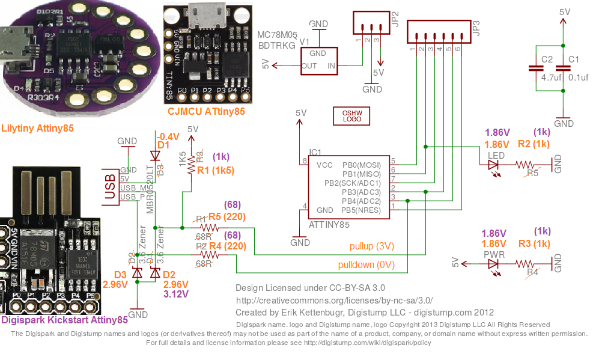

# IOTool_ATtiny85Digispark_LowLevel
Low level api to program ATtiny85 Digispark and Lilytiny at Arduino IDE 1.6.x

## China Lilytiny ATtiny85 - schematic 

This schematic does not able low current applications.

* power led (3mA)
* pullup resistor (1mA)
* voltage regulator

## China Lilytiny ATtiny85 - power consumtion

4.5V battery at 5V-pin:

* 17.05mA @ 1 MHz cpu
* 12.95mA @ 500 kHz cpu
* 11.02mA @ 250 kHz cpu
* 9.46mA @ 125 kHz cpu
* 8.69mA @ 62 kHz cpu
* 8.20mA @ 31 kHz cpu
* 7.65mA @ 15 kHz cpu
* 7.56mA @ 8 kHz cpu
* 7.55mA @ 4 kHz cpu

3.2V dcdc / 4.5V battery at VIN-pin:

* 10.10mA @ 1 MHz cpu
* 7.41mA @ 500 kHz cpu
* 6.12mA @ 250 kHz cpu
* 5.18mA @ 125 kHz cpu
* 4.68mA @ 62 kHz cpu
* 4.41mA @ 31 kHz cpu
* 4.17mA @ 15 kHz cpu
* 4.12mA @ 8 kHz cpu
* 4.11mA @ 4 kHz cpu

minimize current:

* 17.05mA default @ 1 MHz cpu / 4.5V
* 16.60mA power_adc_disable (-0.45mA)
* 14.40mA power_all_disable (-2.00mA)
* 6.19mA sleep power down (-8.21mA) 
* 3.56mA remove power led (-2.63mA)
* 1.88mA use vin-pin / 3.2V

## China Digispark Kickstart ATtiny85

This board is also an implementation of the circuit from Digispark. As with the Lilytiny, different resistors are used. Instead of the 1500 Ohm resistor, 1000 Ohm are used, probably to optimize the assembly in production. Thus the kickstarter board has a higher consumption than the Lilytiny.  

4.5V at 5V-pin (4.5V at VIN-pin)

* 18.4 mA (9.7mA) idle 
* 7.4 mA (2.8mA) sleep
