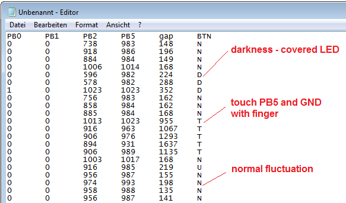

# ADC Logger (simple oscilloscope)

Use Digispark ATtiny85 (Lilytiny) to log analog values to CSV file or excel.

Connected with 10k resistor:

* nothing connected [0..65]
* connect VIN to PB2 [66..82]
* connect 5V to PB2 [100..118]
* connect GND to PB2 [136..163]

## Oscilloscope for Excel

You don't need any extra software to capture analog messures, because the data are send as keyboard input.

After plug in to USB port your Windows computer starts notepad. Now you can switch to Excel or wait until data will logged. To stop the process remove the device.

## Buildin light and touch sensor

Without hardware changes the Lilytiny can be used as light sensor and touch sensor. However, only the difference between absolute darkness and daylight can be recognized. The detection of the touch of PB5 and PB0 with a (dry) finger works much better.

For the light and touch sensor, the fluctuation of the measured values at PB5 is added up, which is artificially generated at the built-in LED. The built-in LED generates a (very small) voltage and current at brightness. The skin works as a resistor between PB5 and GND.  
