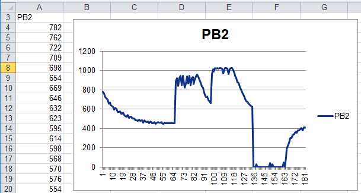

# ADC Logger (simple oscilloscope)

Use Digispark ATtiny85 (Lilytiny) to log analog values to CSV file or excel.

Connected with 10k resistor:

* nothing connected [0..65]
* connect VIN to PB2 [66..82]
* connect 5V to PB2 [100..118]
* connect GND to PB2 [136..163]

## Oscilloscope for Excel

You don't need any extra software to capture analog messures, because the data are send as keyboard input.

After plug in to USB port your Windows computer starts notepad. Now you can switch to Excel or wait until data will logged. To stop the process remove the device.
